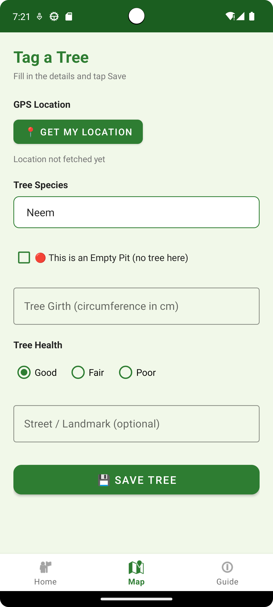
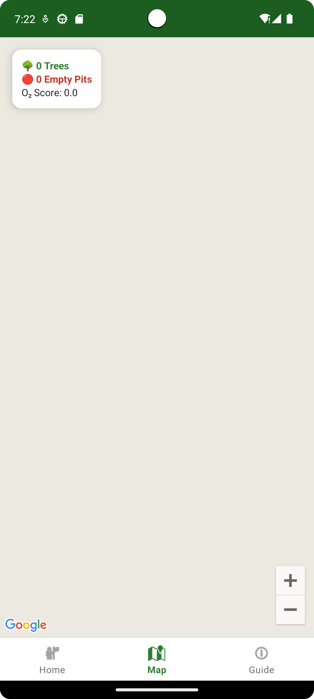
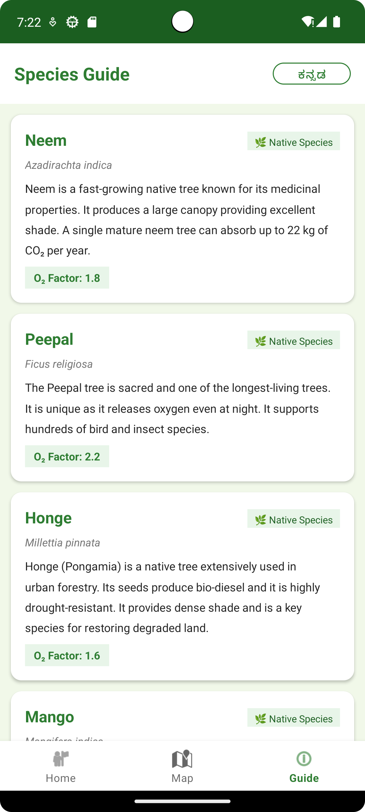

# 🌿 HasiruUsiru App

An Android application for tree tracking and species identification, built to promote urban greenery and environmental awareness.

---

## 📱 About the App

**HasiruUsiru** (meaning "Green Life" in Kannada) is a mobile app that allows users to log, track, and explore trees in their surroundings. Users can add trees to a map, browse a species guide, and contribute to a growing database of urban flora.

---

## ✨ Features

- 🗺️ **Map View** — Visualize logged trees on an interactive map
- ➕ **Add Tree** — Log a new tree with details like species and location
- 📖 **Species Guide** — Browse and learn about different tree species
- 🏠 **Home Dashboard** — Quick overview of activity and stats

---

## 🛠️ Tech Stack

| Technology | Usage |
|---|---|
| Kotlin | Primary programming language |
| Android Studio | IDE |
| XML | UI Layouts |
| Navigation Component | Fragment navigation |
| ViewModel | UI state management |
| Repository Pattern | Data layer architecture |

---

## 📁 Project Structure

```
HasiruUsiru/
├── app/
│   └── src/main/
│       ├── java/com/hasiruusiru/app/
│       │   ├── MainActivity.kt
│       │   ├── data/
│       │   │   ├── model/
│       │   │   │   ├── Tree.kt
│       │   │   │   └── Species.kt
│       │   │   └── repository/
│       │   │       └── TreeRepository.kt
│       │   └── ui/
│       │       ├── home/
│       │       │   ├── HomeFragment.kt
│       │       │   └── HomeViewModel.kt
│       │       ├── map/
│       │       │   └── MapFragment.kt
│       │       ├── addtree/
│       │       │   └── AddTreeFragment.kt
│       │       └── speciesguide/
│       │           ├── SpeciesGuideFragment.kt
│       │           └── SpeciesAdapter.kt
│       └── res/
│           ├── layout/
│           ├── navigation/
│           └── values/
```

---

## 🚀 Getting Started

### Prerequisites
- Android Studio (latest version)
- Android SDK 26+
- Kotlin 1.9+

### Installation

1. Clone the repository:
```bash
git clone https://github.com/deepanshi0203/HasiruUsiru-App.git
```

2. Open the project in **Android Studio**

3. Let Gradle sync automatically

4. Run the app on an emulator or physical device

---

## 📸 Screenshots

| Home | Map | Species Guide |
|---|---|---|
|  |  |  |

---

## 👩‍💻 Developer

**Deepanshi** — [@deepanshi0203](https://github.com/deepanshi0203)

---

## 📄 License

This project is developed for educational purposes.
